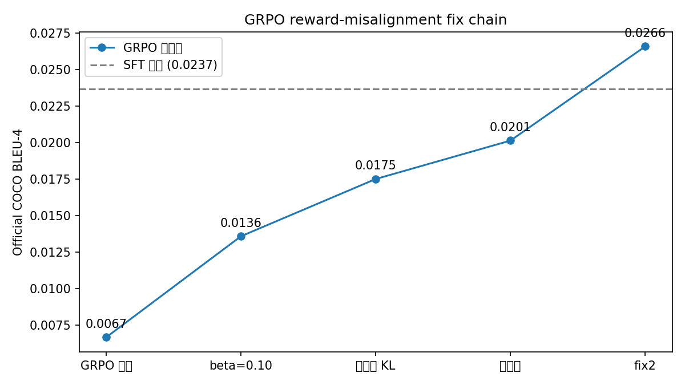
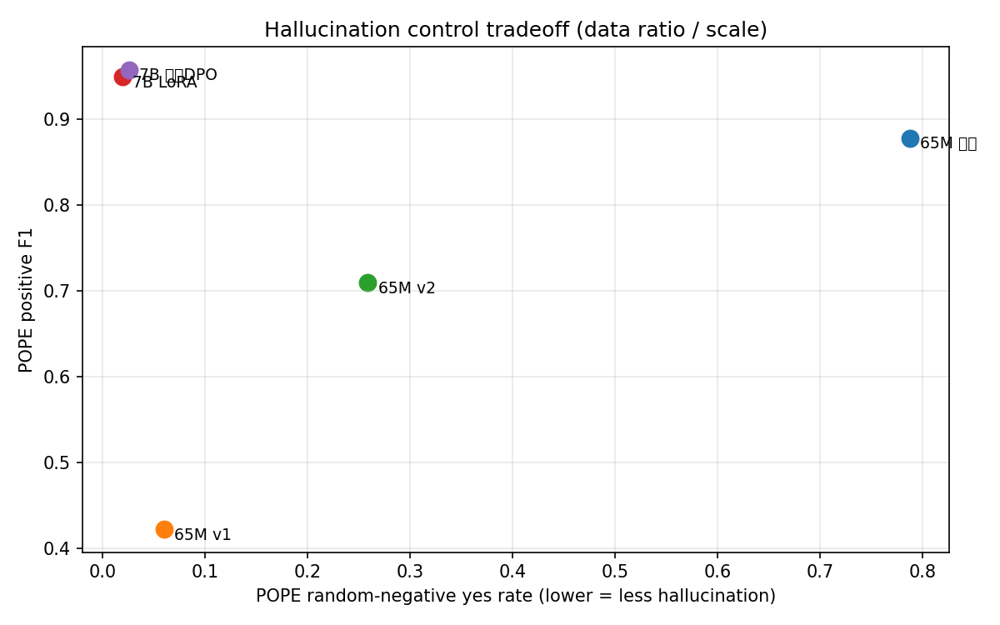
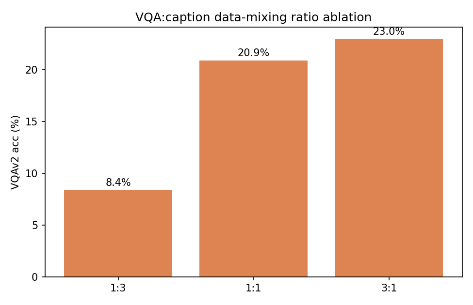

# omniVLM

轻量多模态大模型训练与对齐项目：从 65M 全流程（Pretrain → SFT → GRPO → DPO）到 Qwen2.5-VL-3B/7B LoRA 与 7B 继续预训练，单卡 24GB 全流程可复现。

## 项目背景

- **目标**：构建可复现的多模态 VLM 训练与对齐流水线，覆盖从零预训练、指令微调、GRPO/DPO 对齐到官方评测的全链路；
- **核心研究问题**：GRPO 奖励错位诊断与修复、VQA 短答案格式对齐、幻觉控制、规模跃迁（65M → 3B → 7B）；
- **资源**：全部实验在单张 RTX 4090（24GB）上完成，使用 bf16 与 QLoRA，训练/评测一键可复现。

## 实验配置

| 项目 | 配置 |
|---|---|
| 硬件 | 单卡 RTX 4090（24GB），bf16 |
| 65M 模型 | SigLIP2 视觉编码器 + MLP Projection + MiniMind LLM；Pretrain 仅训投影，SFT 解冻首尾层 |
| 3B / 7B | Qwen2.5-VL + LoRA / QLoRA（r=16/32/64），含 7B 继续预训练与 DPO |
| 数据 | ALLaVA-4V（Pretrain 1.27M / SFT 2.9M）、VQAv2、多任务混合（3.3GB）、幻觉/OCR/空间合成数据 |
| 训练配方 | Pretrain lr 4e-4 bs128 → SFT lr 5e-6 bs64 → GRPO（group 4–16、自适应 KL、CIDEr/judge 奖励）→ DPO（beta 0.1） |
| 评测 | 官方 COCOEvalCap（val2017 全量）、VQAv2（2000 题）、MMBench en/dev（4329 题）、OK-VQA、POPE、纯文本拒答 |

## 结果图表

### 基准总览（65M multitask / 3B LoRA / 7B LoRA）

| 模型 | VQAv2 | MMBench en/dev | COCO CIDEr |
|---|---:|---:|---:|
| 65M multitask | 32.8% | 26.0% | 0.6395 |
| Qwen2.5-VL-3B + LoRA | 82.0% | 84.9% | 0.8364 |
| **Qwen2.5-VL-7B + LoRA** | **82.9%** | **87.6%** | **0.9884** |

### GRPO 奖励错位修复链（官方 BLEU-4）

代理奖励上升但指标退化、KL 扩大 11× → 自适应 KL + 更大 group + CIDEr 对齐奖励 → 官方 BLEU-4 从 0.0067 恢复到 0.0266（超过 SFT 的 0.0237）。

### 幻觉控制权衡曲线（POPE）

65M 存在“数据配比 → 幻觉-召回权衡”曲线；7B 随机负例 yes 率 ~2%、positive F1 0.95+（近饱和）。

### 7B 继续预训练 → DPO 链条（MMBench）

7B 零样本 87.34% → 继续预训练 87.39% → +DPO 86.99%（229 对偏好数据，负收益属 DPO 敏感性发现）。

### VQA:caption 数据配比消融

VQA 数据占比越高 VQA 越强（8.4% / 20.9% / 23.0%），caption 能力保持高位。

## 文档

- [完整实验报告](benchmark_results/official_coco_20260812/REPORT.md)
- [实验思路与预期目标](docs/EXPERIMENT_OVERVIEW.md)
- [多模态训练岗要求对照](docs/TRAINING_ROLE_REVIEW.md)
- [简历项目条目](docs/RESUME_ENTRIES.md)
